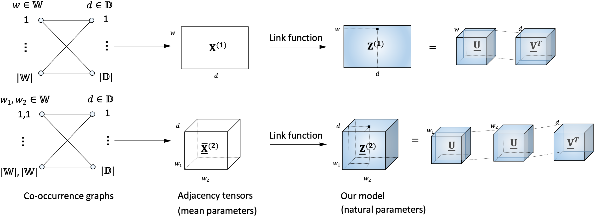

# RDM
Rotation Document Model

In this repository we provide *C* and *Python* code to generate embeddings proposed in our paper.
[[paper]](https://aclanthology.org/2021.findings-acl.146/)



# Install

Here is the list of libraries you need to install to execute the code

C version:

- Intel MKL
- cmake

Python version:

- python >= 3.6
- [pytorch](http://pytorch.org/) >= 1.6
- numpy
- tqdm
- jupyter

# Parameters

C version:
dataset_name n_words n_documents max_order n_epochs batch_size emb_dim lr kappa_init lam rdm

where:

- dataset_name - path to preprocessed dataset
- n_words - number of words in the dataset
- n_documents - number of documents in the dataset
- max_order - maximum order of tensor in the coupled decomposition (e.g, RDM-3 imply 4, because last tensor words x words x words x documents)
- n_epochs - number of epochs of SGD
- batch_size - batch size and number of negative samples (batch_size = n imply n - 1 negative samples)
- emb_dim - dimension of embedding and rank of tensor chain decomposition
- lr - learning rate
- kappa_init - initialization of kappa
- lam - strength of l2 regularization of kappa
- rdm - hyperparameter to choose between RDM (model with rotation constraints) and RDM-R (model without rotation constraints)


# Citation
```
@inproceedings{vorona-etal-2021-documents,
    title = "Documents Representation via Generalized Coupled Tensor Chain with the Rotation Group constraint",
    author = "Vorona, Igor  and
      Phan, Anh-Huy  and
      Panchenko, Alexander  and
      Cichocki, Andrzej",
    booktitle = "Findings of the Association for Computational Linguistics: ACL-IJCNLP 2021",
    month = aug,
    year = "2021",
    address = "Online",
    publisher = "Association for Computational Linguistics",
    url = "https://aclanthology.org/2021.findings-acl.146",
    doi = "10.18653/v1/2021.findings-acl.146",
    pages = "1674--1684",
}
```
